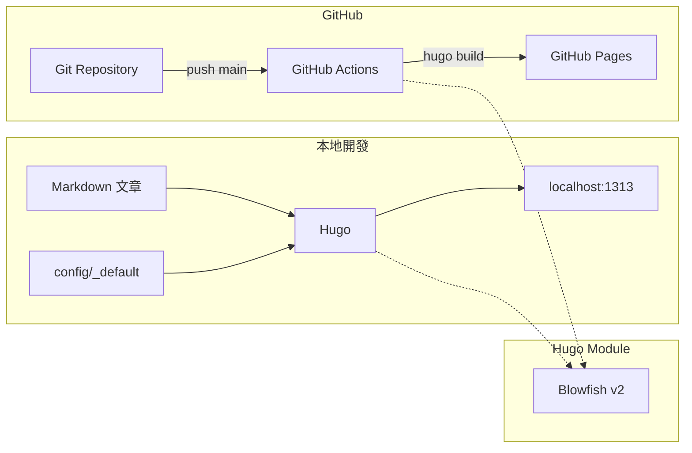

# Hugo Blowfish 部落格框架

以 [Hugo](https://gohugo.io/) 與 [Blowfish](https://blowfish.page/) 主題打造的 GitHub Pages 靜態部落格框架。Push 到 `main` 分支後，GitHub Actions 會自動建置並部署。

## 架構概覽



## 專案結構

```text
.
├── .github/workflows/gh-pages.yml   # CI/CD 部署流程
├── archetypes/posts.md              # 新文章範本
├── assets/img/                      # 圖片資源（作者頭像、文章配圖）
├── config/_default/                 # Hugo 與 Blowfish 設定
│   ├── hugo.toml                    # 站點基本設定
│   ├── module.toml                  # Blowfish 主題模組
│   ├── params.toml                  # 主題外觀與行為
│   ├── languages.zh-tw.toml         # 繁體中文語系
│   ├── menus.zh-tw.toml             # 導覽選單
│   └── markup.toml                  # Markdown 渲染設定
├── content/                         # 網站內容
│   ├── _index.md                    # 首頁
│   ├── about.md                     # 關於頁
│   └── posts/                       # 部落格文章
├── scripts/new-post.sh              # 快速建立新文章
├── go.mod                           # Hugo Modules 依賴
└── README.md
```

## 前置需求

| 工具 | 版本建議 | 用途 |
|------|----------|------|
| [Hugo Extended](https://gohugo.io/installation/) | ≥ 0.158 | 靜態網站產生器（需 Extended 版以支援 SCSS；Blowfish v2.103+ 需要 ≥ 0.158） |
| [Go](https://go.dev/dl/) | ≥ 1.21 | Hugo Modules 下載主題 |
| [Git](https://git-scm.com/) | 任意 | 版本控制 |
| GitHub 帳號 | — | 託管與部署 |

## 快速開始

### 1. 建立 GitHub Repository

兩種常見部署方式：

| 類型 | Repository 名稱 | 網址範例 | `baseURL` 設定 |
|------|-----------------|----------|----------------|
| 使用者網站 | `your-username.github.io` | `https://yangmark.github.io/` | `https://yangmark.github.io/` |
| 專案網站 | `blog`（任意名稱） | `https://yangmark.github.io/blog/` | `https://yangmark.github.io/blog/` |

> GitHub Actions 會在建置時自動覆寫 `baseURL`，但本地開發時請在 `config/_default/hugo.toml` 設定正確的 `baseURL`。

### 2. 個人化設定

依序修改以下檔案：

1. **`go.mod`** — 將 `github.com/yangmark/blog` 改為你的 repository 路徑
2. **`config/_default/hugo.toml`** — 設定 `baseURL`
3. **`config/_default/languages.zh-tw.toml`** — 網站標題、作者名稱、社群連結
4. **`assets/img/author.jpg`** — 放入作者頭像
5. **`config/_default/menus.zh-tw.toml`** — 調整導覽選單
6. **`config/_default/params.toml`** — 配色（`colorScheme`）、首頁版型等

### 3. 本地預覽

```bash
# 安裝依賴並啟動開發伺服器
hugo mod get -u ./...
hugo server -D
```

開啟 [http://localhost:1313/blog/](http://localhost:1313/blog/) 預覽。`-D` 會包含 `draft: true` 的草稿文章。

### 4. 部署到 GitHub Pages

```bash
git init
git add .
git commit -m "Initial blog setup with Hugo Blowfish"
git remote add origin https://github.com/yangmark/blog.git
git push -u origin main
```

在 GitHub Repository 設定：

1. 前往 **Settings → Pages**
2. **Source** 選擇 **GitHub Actions**
3. 等待 workflow 完成，網站即可上線

## 撰寫文章

### 使用腳本（推薦）

```bash
./scripts/new-post.sh "我的文章標題"
```

### 使用 Hugo CLI

```bash
hugo new posts/my-article/index.md
```

### Page Bundle 結構

Blowfish 建議使用 **Page Bundle** 組織文章，圖片與文章放在同一資料夾：

```text
content/posts/my-article/
├── index.md          # 文章內容
├── feature.jpg       # 特色圖片（選用）
└── diagram.png       # 內文配圖（選用）
```

### 常用 Front Matter

```yaml
---
title: "文章標題"
summary: "列表頁顯示的摘要"
date: 2026-06-16
draft: false
tags: ["hugo", "blowfish"]
categories: ["教學"]
showTableOfContents: true
---
```

發布前將 `draft` 設為 `false`，或本地用 `hugo server -D` 預覽草稿。

## 主題自訂

### 配色方案

在 `config/_default/params.toml` 修改 `colorScheme`：

```
blowfish | github | noir | forest | neon | terminal | ...
```

完整列表見 [Blowfish 文件](https://blowfish.page/docs/getting-started/#colour-schemes)。

### 首頁版型

`params.toml` 的 `[homepage]` 區塊支援多種版型：

| layout | 說明 |
|--------|------|
| `page` | 一般頁面 + 最新文章（目前預設） |
| `profile` | 個人檔案風格首頁 |
| `hero` | 大圖 Hero 橫幅 |
| `card` | 卡片式文章列表 |

### 深色模式

```toml
defaultAppearance = "dark"      # 預設深色
autoSwitchAppearance = true     # 跟隨系統設定
```

## CI/CD 流程

`.github/workflows/gh-pages.yml` 在每次 push 到 `main` 時：

1. Checkout 原始碼
2. 安裝 Hugo Extended 與 Go
3. 透過 Hugo Modules 下載 Blowfish 主題
4. 執行 `hugo --gc --minify` 建置靜態檔案
5. 部署到 GitHub Pages

## 常見問題

**Q: 建置失敗，提示找不到主題？**

確認已安裝 Go，並執行 `hugo mod get -u ./...` 下載 Blowfish 模組。

**Q: 樣式沒有正確載入？**

必須使用 **Hugo Extended** 版本，標準版不支援 SCSS 編譯。

**Q: 文章圖片無法顯示？**

將圖片放在文章同層的 Page Bundle 資料夾內，並使用相對路徑引用。

**Q: 想改用 Git Submodule 安裝主題？**

參考 [Blowfish 安裝文件](https://blowfish.page/docs/installation/)，並在 workflow 加入 `submodules: true`。

## 參考資源

- [Blowfish 官方文件](https://blowfish.page/docs/)
- [Hugo 官方文件](https://gohugo.io/documentation/)
- [GitHub Pages 文件](https://docs.github.com/en/pages)
- [Blowfish GitHub](https://github.com/nunocoracao/blowfish)

## 授權

內容與框架設定可自由修改。Blowfish 主題授權請參閱其 [GitHub Repository](https://github.com/nunocoracao/blowfish)。
